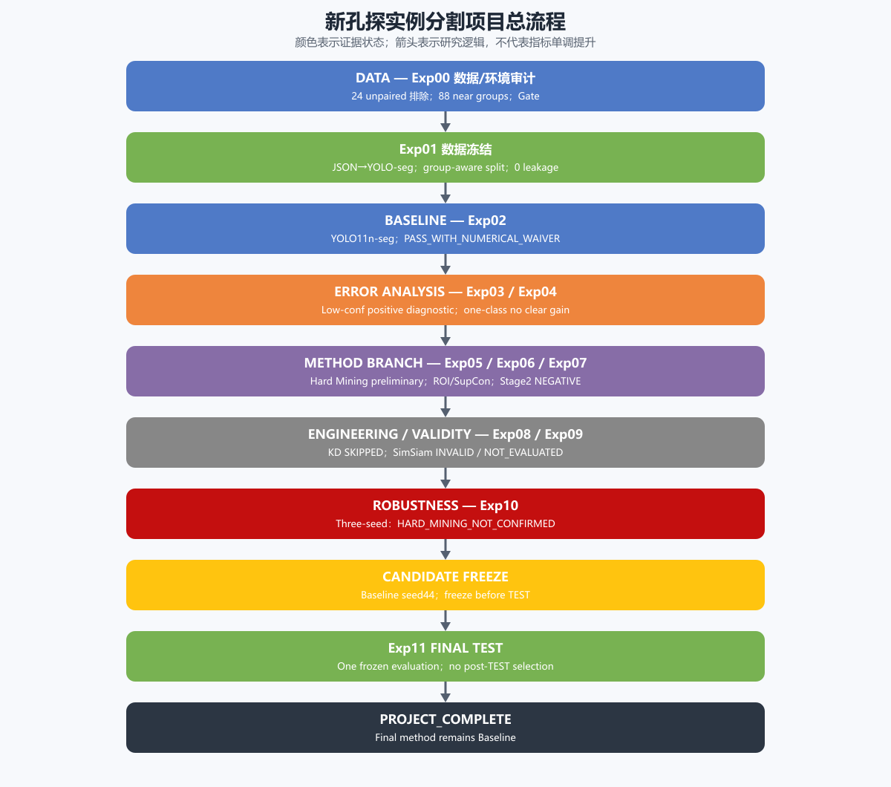
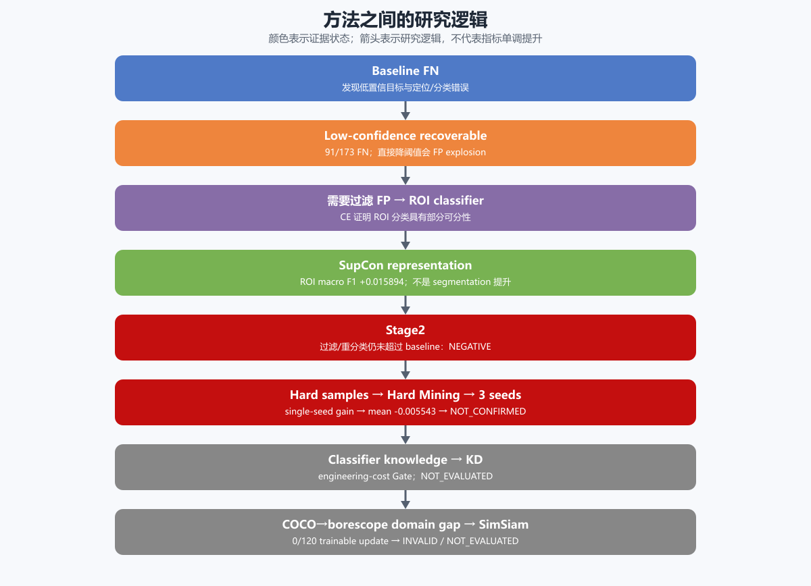

# 新孔探多类别实例分割：项目全流程串讲

## 一句话主线

这个项目不是“连续尝试方法并不断涨点”，而是先把数据和评估边界做可靠，再用错误分析提出受控问题，通过 Gate 和多随机种子逐步排除不稳健、工程不可行或实现无效的路线，最后在 TEST 之前冻结证据最稳健的 Baseline。

术语约定：False Positive（FP，假阳性）、False Negative（FN，假阴性）、Region of Interest（ROI，感兴趣区域）、Supervised Contrastive Learning（SupCon，监督式对比学习）、Knowledge Distillation（KD，知识蒸馏）。mAP50-95、ROIAlign、AMP、FP32、YOLO、ResNet 和 SimSiam 保留工程通用写法。

~~~mermaid
flowchart TD
    A[Exp00 数据与环境审计] --> B[Exp01 group-aware 数据冻结]
    B --> C[Exp02 Baseline 与数值稳定性审计]
    C --> D[Exp03 / Exp04 错误与因果诊断]
    D --> E[Exp05 Hard Mining 单种子候选]
    D --> F[Exp06 ROI CE / SupCon 表征]
    F --> G[Exp07 Stage2 决策系统]
    F --> H[Exp08 KD 工程 Gate]
    C --> I[Exp09 SimSiam 工程有效性 Gate]
    E --> J[Exp10 三随机种子复核]
    G --> K[候选比较]
    H --> K
    I --> K
    J --> K
    K --> L[TEST 前冻结 Baseline seed44]
    L --> M[Exp11 一次性 TEST]
    M --> N[PROJECT_COMPLETE]
~~~

## 1. 从原始 JSON polygon 开始：为什么 Exp00 不能省

原始目录看似是“图片+标注”，但训练前至少有四个未知：图片和 JSON 是否一一配对、真实类别是什么、polygon 是否合法、相邻帧是否会跨 split。Exp00 实测得到 993 张图片、969 份 JSON、969 对权威监督样本和 24 张无 JSON 图片。因为无 JSON 不等于背景，项目没有补空标注，而是按用户政策把 24 张记为 excluded_unpaired。

重复审计没有发现 exact duplicate，却发现 88 个 near-duplicate 连通组覆盖 252 张图。它们多为同部位轻微视角变化。若简单 random split，同一场景可能同时进入 TRAIN 和 VAL/TEST，使泛化指标被泄漏抬高。因此 Exp00 的结果不是“数据没问题”，而是明确告诉 Exp01：必须 group-aware。

## 2. Exp01：从可读标注到可复现数据版本

Exp01 将 1847/1847 个专业 polygon 转成 YOLO segmentation，固定 7 类 mapping，再把 88 个 near group 当作不可拆单元做 seed42 分层划分。最终 TRAIN/VAL/TEST 为 668/154/147 张，实例数 1266/296/285，已知 near-group cross-split leakage 为 0。

manifest、class mapping 和 split 都保存 SHA256。冻结的意义是：后续方法不能悄悄换数据；TEST membership 虽已存在，但不能用于训练、阈值或模型选择。split SHA256 是 35d577c18eee0a697c4eae9119b9950197f949e8c6c737b57f2018f7f9c9634d。

## 3. Exp02：Baseline 不只是一个分数

先做 batch probe 与完整 smoke，是为了确认数据、forward/backward、checkpoint 保存和 reload 都可用。batch 8/16/24/32 全通过，最终冻结 batch32。随后 seed42 YOLO11n-seg 640/100 epoch 得到 VAL Mask mAP50-95=0.298981；固定 conf .25 时 TP/FP/FN=123/99/173、F1=0.474903。

但训练日志的 epoch1–5 VAL loss 是 NaN。项目没有用“最终模型能跑”掩盖它，而是用 Exp02.2a 找到 FP16 C2PSA attention qk matmul overflow：同 checkpoint/同 batch 在 AMP 下非有限、FP32 下有限，epoch6 后模型自动恢复。最终 checkpoint 可加载且 tensors finite，因此用户接受 PASS_WITH_NUMERICAL_WAIVER。这是一种可审计的风险接受，不是把 NaN 改写成 PASS。

尺度审计同样推翻了直觉：Recall 没有随目标变大而单调提高，large 甚至最低。这就是为什么没有为了“补一个问题”自动做 960 训练。

## 4. Exp03：低置信候选为什么既是机会也是陷阱

173 个 FN 中，91 个（52.6%）在更低置信区间已经有可匹配候选。这证明模型并非完全没看到它们。但把 conf 降到 .005 时，FP 达到 4569，F1 只有 .08049。因此结论是 POSITIVE_DIAGNOSTIC：低置信现象真实存在，但不能直接把低阈值当改进方案。

这自然提出两个问题：困难类是否被多类竞争拖累（Exp04）？是否能用额外判别器过滤低阈值带来的 FP（Exp06/07）？

## 5. Exp04：Crack one-class 是因果诊断，不是另起炉灶

只保留 Crack supervision，可以隔离“多类别竞争”解释。结果 one-class Recall 从 multi-class 的 .27883 降到 .16667，AP50-95 只从 .04675 到 .05548。证据不足以支持清晰增益，所以是 NO_CLEAR_GAIN。它把研究重心从“类别竞争”移向定位、表征和固有难度。

## 6. Exp05：为什么 Hard Mining 必须有 Control

Hard Mining 的 Treatment 会继续训练；如果只看 Treatment，任何提升都可能只是多训练 30 epoch 的结果。因此 Control 也从同一 checkpoint 出发、同样 replacement sampler、同样消费 20,040 images 和 331 optimizer steps。唯一变量是 hard weight 1→2。

seed42 的 Treatment−Control Mask mAP50-95 是 +0.030354，看起来很有希望。但它仍只是 single-seed preliminary evidence。项目保留它作为候选，而不是提前宣布方法有效。

## 7. Exp06：为什么从 segmentation 转向 ROI classification

Exp03 已经给出候选，但 FP 太多。于是暂时把定位拿掉，只给 1.2× ROI，测试类别本身是否可分。CE ResNet18 在 592 个 VAL ROI 上 macro F1=.677804，说明多数类有判别信号，但 corrosion/background 混淆仍明显。

Supervised Contrastive Learning（SupCon，监督式对比学习）在相同 manifest、sampler、seed 和训练预算下增加对比表征目标，macro F1 到 .693698，Δ=+.015894。这只能表述为 ROI representation improved。它没有修改 segmentation model，也没有得到 segmentation mAP，因此不能说“SupCon 提高分割”。

## 8. Exp07：为什么合理的两阶段直觉仍会失败

Stage1 用较低 conf 提候选，Stage2 用冻结 SupCon classifier 过滤（Mode A）或过滤+重分类（Mode B），mask 始终来自 Stage1。最佳 Mode A/B 的 F1=.452336/.450820，都低于 baseline .474903。Mode B 的 FP 从99降到82，却让 FN 从173升到186。

失败的关键不是 classifier 完全不会分类，而是系统决策链：91 个可恢复 FN 中有70个在所选 Stage1 conf=.15 时已经没有候选；其余候选又会被 Stage2 误删。局部模块有正信号，不保证系统整体改善。

## 9. Exp08：SKIPPED 不等于 KD 无效

Knowledge Distillation（KD，知识蒸馏）的动机是把 classifier knowledge 回灌 YOLO，避免部署两阶段链。工程 smoke 证明 chunking 后 batch32 forward/loss finite，但单 training step 超过70秒；若要正式跑完，需要 teacher cache 或数据管线重构，超出边界。因此正式 AUX_CE/KD、VAL comparison 和参数搜索都没发生，状态是 SKIPPED_BY_ENGINEERING_GATE / NOT_EVALUATED。

## 10. Exp09：为什么 loss 正常仍可能是无效实验

SimSiam 100 epoch 的 loss finite，feature/embedding std 非零，看起来没有 collapse。但参数 delta audit 发现：相对 COCO 初始化，0/120 个 trainable backbone parameters 改变，只有 120/120 个 BatchNorm buffers 改变。换句话说，表面曲线在动，却没有形成可用于适配的可训练参数变化。

Exp09.2a 又证明 transfer 机制本身是对的：key/shape240/240、immediate trainable120/120、FP32/native round-trip240/240。因此最终结论是本次 SSL implementation/optimization INVALID_BY_BACKBONE_NO_UPDATE，downstream NOT_RUN_BY_GATE，performance NOT_EVALUATED。不能把它外推为“SimSiam 方法失败”。

## 11. Exp10：单 seed 阳性为什么最终没有入选

Exp10 用 seeds42/43/44 进行预算匹配 Control/Treatment 比较。Treatment−Control Mask mAP50-95 分别为 +.030354、−.006673、−.040311，只有1/3为正，平均 −.005543±.035346。因此 Exp05 的 seed42 正信号没有复现，最终状态 HARD_MINING_NOT_CONFIRMED。

这一步说明为什么三随机种子重要：它改变的不是“小数点后稳定性”，而是方法方向的结论。

## 12. Candidate Freeze：为什么最后回到 Baseline

最终不是挑 TEST 最好的模型，而是在 TEST 未访问时按冻结 VAL 选择。Baseline seeds42/43/44 的 Mask mAP50-95 为 .298981/.299506/.325157，seed44 最高；Hard Mining 又未被三 seed 确认。因此冻结 Baseline seed44 checkpoint，SHA256 2dbec80d31d978bdadcd436cf243921be81903284e00b08c5beb75d9808948e9，freeze commit 9991fcfcb9cf6c0ab8920ad7deadeed579ce5585。

## 13. Exp11：TEST 只回答泛化，不再回答“选谁”

最终 TEST 的 Mask P/R/mAP50/mAP50-95=.680727/.498654/.582704/.271621；Box mAP50-95=.293253。冻结 VAL 到 TEST 的 Mask mAP50-95 delta 为 −.053536。这个下降可以讨论域内采样波动、类别/场景差异和泛化难度，但不能成为重新调参或换 seed 的理由。

首次 Exp11 因客户端超时在指标前中断，证据被保留；只有在用户明确授权后才以相同 checkpoint/evaluator/参数重试一次。随后 MODEL_SELECTION_CLOSED=true，项目状态为 PROJECT_COMPLETE。

## 14. 方法之间不是乱试

~~~mermaid
flowchart LR
    FN[Baseline FN] --> LC[低置信可恢复候选]
    LC --> FP[直接降阈值导致 FP 激增]
    FP --> ROI[ROI CE 分类器]
    ROI --> SC[SupCon ROI 表征]
    SC --> S2[Stage2 过滤与重分类]
    S2 --> NEG[未超过 Baseline：NEGATIVE]
    FN --> HM[Hard Mining]
    HM --> SS[seed42 初步正向]
    SS --> MS[三随机种子复核]
    MS --> NC[NOT_CONFIRMED]
    SC --> KD[KD]
    KD --> KG[工程 Gate：NOT_EVALUATED]
    DG[COCO→孔探域差异] --> SSL[SimSiam]
    SSL --> PA[参数变化审计]
    PA --> INV[0/120 可训练参数改变：INVALID]
~~~

每条分支都有前序证据：FN→low conf→FP filtering→ROI classifier→SupCon→Stage2；hard samples→single-seed gain→three-seed not confirmed；classifier knowledge→KD engineering Gate；domain gap→SimSiam→parameter audit invalid。研究价值就在这种“提出限定问题—受控验证—按 Gate 收口”的链条中。

## 最终能够独立讲出的结论

1. 数据工程和防泄漏是指标可信的前提。
2. Baseline 的困难来自 confidence、localization、classification、class imbalance 与 scale coupling，而不是单一因素。
3. Low-confidence 与 SupCon 是限定域内的 positive diagnostic/representation evidence，不是最终 segmentation improvement。
4. Stage2 是 negative；KD 是 engineering-gated/NOT_EVALUATED；SimSiam reconstruction 是 invalid/NOT_EVALUATED。
5. Hard Mining 的单 seed 增益未通过三 seed 复现。
6. 最终选择 Baseline，不是“没有尝试”，而是证据纪律下最稳健的决定。
